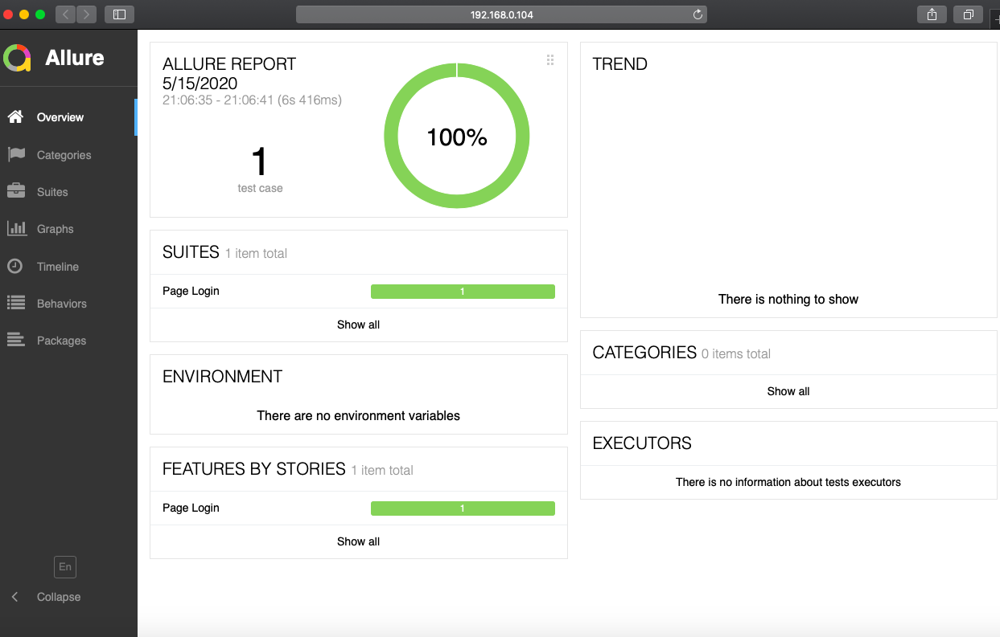

# E2E-tests

Skeleton for E2E tests with TestCafe

## How to

#### Install dependencies

```ssh
npm run dev
```

### User Creds

Create ENV variable `USERNAME_GUI` & `PASSWORD_GUI`. We need this for SSO authentication. Without doing this you
can't run the tests.

### Run tests

If you want to run a specific test, you need to change `TESTSET` (in meta of the test), e.g. `test` and then run:

```ssh
npm run test

or if you want to run the complete regression test, you need to run: 

npm run test:regression
```

### Generate report

```ssh
npm run report

// publish report

npm run report:publish
```

Reports, screenshots and videos will be generated inside `reports` folder.

### Slack notification

If you want to send notifications to slack, you need to create a webook add add the creds in the .env file. Otherwise the tests will run, but slack won't get any notifications.

### Create tests

- Create a new branch with `feature/story-id-with-a-name`
- Modify the correct test and resource files

### Naming conventions

See [Naming conventions](./docs/guidelines/naming-conventions.md) file

### Test Folder Structure

```
testcafe
|____data
|____docs
| |____guidelines
|   |____naming-conventions.md
|____environment
| |____env.ts
|____resources
| |____assertions
|   |____index.ts
| |____business_objects
|   |____index.ts
| |____page_objects
|   |____index.ts
|____reports
|____tests
| |____simpleTest.test.ts
|____utils
| |____config.helper.ts
| |____index.ts
```

The page object model resides under `resources` folder.

- `data` folder contains files used in tests
- `resources` folder contains the page elements and associated business logics
- `tests` folder contains testcafe fixtures and tests
- `utils` folder contains different testcafe helpers

### Allure report

Reports will be generated for each test cases and allure will integrate those results and combine. When you've published
your reports it will look like:



## TODO

* Seperate element locators and methods
* CI/CD
* Run in docker
* Implement Gherkin/Cucumber
* ...

## Resources

* [Testcafe guide](https://devexpress.github.io/testcafe/documentation/guides/)
* [Tescafe examples](https://devexpress.github.io/testcafe/documentation/examples/)